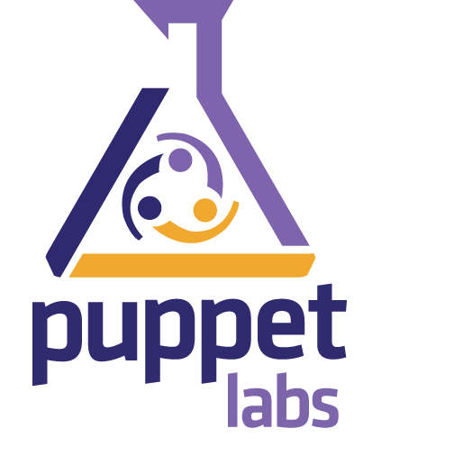

***
#DevOps 
##Una introducción

---
## Agenda

* Presentación
* Interacción entre infraestructura y desarrollo
* Necesidad de ambientes independientes
* Soluciones y más problemas
* DevOps
* Herramientas
***
***
# Presentación
---
## Sobre Mikroways

* Brindamos servicios de TI, específicamente relacionados a la infraestructura
  tecnológica de nuestros clientes. 
* Diseñamos e implementamos soluciones a medida según las necesidades de cada
  cliente.
* Damos soporte para solucionar cualquier problemática que surja en el
  funcionamiento de la infraestructura tecnológica existente.
* Proveemos capacitación al personal de sistemas, adaptando los cursos a los
  requerimientos específicos.

---
## Sobre Mikroways

**Algunos de nuestros clientes**
<table class="product_logos">
<tr>
  <td>  </td>
  <td>      </td>
  <td>  </td>
</tr>
<tr>
  <td>  </td>
  <td>  </td>
  <td>  </td>
</tr>
<tr>
  <td>  </td>
  <td>  </td>
  <td>  </td>
</tr>
</table>

---
## Nuestros servicios
* Devops
* Computación en la nube
* Consultoría
* Escalabilidad de aplicaciones web
* Outsourcing
* Monitoreo inteligente
* Capacitación
---
## Presentación personal

* Docente en UNLP
* Trabajé en IT mayormente de 2000 a 2007
* Dicté cursos de CCNA/RedHat/Solaris/IRIX
* A partir de 2006 me aboqué al desarrollo web y coordinación de proyectos de
  software
  * Empecé con Devops en 2012
  * [Capacitación sobre chef 2013](http://chrodriguez.github.io/capacitacion_chef/)
---
## Contribuciones de SL

* [Ruby Scripting para Spoon de Pentaho](https://github.com/slawo-ch/ruby-scripting-for-pdi) (Kettle)
* [chef-provisioning-vsphere](https://github.com/CenturyLinkCloud/chef-provisioning-vsphere)
* [chef-provisioning-fog](Soporte://github.com/chef/chef-provisioning-fog)
* [Redmine SAML plugin](https://github.com/chrodriguez/redmine_omniauth_saml)
* [Redmine per project sender plugin](https://github.com/chrodriguez/redmine_per_project_sender)
* [xmltv tv\_grab\_ar](http://wiki.xmltv.org/index.php/Main_Page)
* [VDR - The Video Recorder Disk](http://www.tvdr.de/)
* Varias recetas de chef
* Varias gemas de ruby
* Plugins para Symfony 1.x
***
***
# Interacción entre IT y Desarrollo
---
## Introducción

* Cada organización tiene sus particularidades, aunque en varios
  lugares coincide que:
  * Se conforman grupos de trabajo disjuntos para desarrollo e infraestructura
  * Desarrollo es un cliente de infraestructura
  * Infraestructura atiende cuestiones *complejas* que son críticas
  * No hay diálogo fluido entre las partes
  * Desarrollo aplica metodologías ágiles, mientras que infraestructura lidia
    con problemas en los que es difícil seguir el ritmo que solicita desarrollo
---
## Analizaremos la problemática desde

* La perspectiva de desarrollo
* La perspectiva de infraestructura
* La puesta en producción: el momento en que desarrollo e infraestructura
  interactúan
***
***
# La perspectiva de desarrollo
---
## La perspectiva de desarrollo

* Ambientes complejos:
  * Arquitecturas de N capas
  * Micro servicios
  * Muchas *inter*dependencias en un desarrollo moderno
* Gestión de los proyectos: procedimientos y flujos de trabajo
* La forma en que se deployan nuevos productos o actualizan versiones
* Usando metodologías ágiles se maximiza la velocidad de nuevos releases.
  * Ésto impulsa nuevos deployments en algún ambiente (testing, staging, QA) o
  directamente en producción
---
## La perspectiva de desarrollo

* Si se aplica TDD, se requiere mantener una infraestructura donde los
  tests contribuyan con la gestión de los proyectos
  * Que los tests pasen antes de un merge
  * Integración continua
* Lenguajes y herramientas modernas disponibles en el ambiente de desarrollo pero
  diferentes en producción
* Gestión de versiones
  * [Semantic Versioning](http://semver.org/) para el código
  * ¿Qué pasa con la base de datos?
* Replicar el ambiente de producción para analizar problemas, así como probar
  una actualización de versiones
* Necesidad de estadísticas y monitoreo

---
### Ambientes complejos
* Las aplicaciones ya no son las tradicionales arquitecturas de tres capas
* Las herramientas a utilizar ya no sólo se conforman de **un** lenguaje,
  una base de datos SQL y un framework
* Necesidad de ambientes independientes entre los desarrolladores
  * Algunas organizaciones promueven un ambiente común de desarrollo donde toda
    la complejidad se concentra en un cluster compartido por N desarrolladores
* Dificultad para involucrar nuevos integrantes
  * Exceso de tiempo para aprender a gestionar la infraestructura en vez de
    programar
---
### Gestión de proyectos
* Independientemente de la gestión de proyectos teórica y comercial hacemos
  hincapié en los procedimientos para trabajar
* Respetar estándares de codificación
* Utilizar alguna herramienta de versionado de código: GIT
  * [git-flow](https://github.com/nvie/gitflow): *trabajo con estrategias de branches y manejo de releases*
  * Permisos sobre las branches: *desarrolladores con más experiencia revisan el
    código de programadores con menos experiencia. Por ejemplo: [flujo tipo GitHub](https://guides.github.com/introduction/flow/)*
---
### Gestión de proyectos
* Relacionar los tickets/versiones del producto en producción, con los 
  procedimientos/flujos definidos anteriormente
  * Esto mismo sugiere git-flow con los [hotfix
    branches](http://nvie.com/posts/a-successful-git-branching-model/#hotfix-branches)
* Aplicar buenas prácticas de calidad 
  * TDD con alta cobertura
  * Tests de aceptación
* Aspiraciones para alcanzar:
  * Integración continua
  * Delivery continuo
  * Deployment continuo
---
### Deployments
* Poner una versión de un producto nuevo en producción puede
  * Ser simple si el ambiente ya existe y no requiere nuevas dependencias
  * Ser complejo si el producto a instalar requiere nuevas dependencias
* Revisar si cada una de las dependencias satisfacen sus requerimientos
  * ¿El código provee de ésta información?
* Automatizar los deployments simplificando las tareas repetitivas
  * Usar scripts caseros o herramientas de automatización como Capistrano,
    Ansible, Chef, Puppet, Salt, etc
---
### Metodologías Ágiles
* El [manifiesto ágil](http://www.agilemanifesto.org/iso/es/) hace énfasis en
  los siguientes valores:
  * Individuos e interacciones
  * Software funcionando
  * Colaboración con el cliente
  * Respuesta ante el cambio
* Aplicando esta metodología se promueve lanzar nuevas versiones en períodos muy
  cortos de tiempo, lo cuál termina manifestando un cuello de botella en las
  oficinas de IT.
  * Responder a los requerimientos ágiles requiere una operatoria ágil desde IT
  * Empiezan a darse deployments con frecuencias diarias e incluso varios al día
---
### TDD

* Cuando elevamos los requerimientos de QA es bueno aplicar tests
* Los tests deben controlarse por QA, en cada etapa del desarrollo, estableciendo
  políticas de aceptación para cada etapa
---
### TDD
* Ejemplos de políticas:
  * El código no es revisado antes de mergerarse si no pasan los test de unidad,
    funcionales e integración. Tampoco si el analizador de código no garantiza
    se respetan estándares
  * Un release no pasa a producción si no pasa todos los tests de unidad,
    funcionales e integración
* Es importante poder aplicar [Integración Continua](https://en.wikipedia.org/wiki/Continuous_integration). 
  Sin embargo, armar un ambiente de éste tipo no es trivial y depende del área
  de IT
---
### Versiones de librerías y lenguajes
* Es común que los desarrolladores surfeen la cresta de las olas
  * Utilizan versiones muy actuales de determinados productos que complican
    los ambientes
  * Algunos lenguajes no permiten, *de forma simple*, tener en el sistema más de una versión de una
    misma librería o lenguaje. Por ejemplo PHP
* Esto crea diferencias entre el ambiente de desarrollo y producción
  * Justamente, ésta es la brecha que debemos achicar
---
### Gestión de versiones

* Si bien el código se maneja con versiones y GIT/SVN mantiene una
  identificación de cada commit, se necesita manejar un versionado de releases
  amigable
* [Semantic Versioning](http://semver.org/) contribuye a entender qué significa
  que un release 2.5.1 pase a la versión 2.5.2 o 2.6.0
* ¿De qué forma es posible mantener la traza del modelo de datos respecto de las
  versiones de código?
---
### Acceso al ambiente de producción

* Siempre es necesario acceder a un recurso en producción
* Acceso al dump o código completo
  * El código no debería ser necesario si se utilizan versiones que respetan el
    versionado *semver* o desde un SCM
  * Los datos de una aplicación en producción (no la base de datos) pueden ser
    necesarios para realizar una prueba
* A veces, por requerimientos de seguridad o legales, la información debe
  obtenerse ofuscada
* Otras veces, alcanza con un dato antiguo que puede extraerse desde un backup
---
### Replica del ambiente de producción

* Poder obtener un ambiente similar al productivo tiene un valor muy grande para
  desarrollo dado que permite:
  * Verificar problemas offline
  * Probar nuevos releases antes de pasarlos a producción
  * Al cliente verificar en una instancia previa al pasaje a producción
    de un cambio
  * Verificar tiempos de actualización
  * etc
---
### Estadísticas y monitoreo

* Las estadísticas generalmente se utilizan por IT para conocer cómo se comporta
  un servidor o recurso
* Desde desarrollo hay varios aspectos que pueden medirse para luego ayudar a identificar
  problemas:
  * Profiling de cada middleware de una aplicación: ORM, servicios externos,
    renderizado, caching, tiempos de respuesta, etc
  * Errores en la aplicación
* Contar con la información estadística nos permite conocer el comportamiento
  normal de nuestra aplicación
  * Desconocer estos datos es manejar con el parabrisas lleno de barro
---
### Estadísticas y monitoreo
* Cuando un valor se va de la media o el desvío estándar por más de un tiempo
  aceptable, entonces podemos establecer una alerta
* Generalmente el monitoreo y las alertas se establecen sobre los servicios o
  sobre los recursos que son cruciales, y ante el mínimo problema se notifica a
  determinados usuarios
  * Esto produce innumerables alertas que terminan siendo ignoradas
* El monitoreo debería concentrase en lo que es de valor para el usuario que
  utiliza el recurso y no en las partes que constituyen el servicio
***
***
# La perspectiva de infraestructura
---
## La perspectiva de infraestructura
<small>
Los ejemplos expuestos no son aplicables a todos los casos, sino una enumeración
de problemas habituales en las áreas de infraestructura
</small>

* Según el tipo de organización, este área puede atender servicios críticos
  como: DNS, Mail, Web institucional, comunicaciones, virtualización, gestión de
  usuarios vía SQL/LDAP/ADS
* Varias organizaciones gestionan sus servicios en forma manual
---
## La perspectiva de infraestructura
* El área de desarrollo es un área más a la que se le brinda servicio
* Las políticas de homogeneizar lenguajes, frameworks, servicios o cualquier
  herramienta informática han fracasado en pos de arquitecturas heterogéneas
* Atender la seguridad que se ve comprometida cuando se permite el hosting
  manipulado por el área de desarrollo
* Política de backups clara para los servicios pero no para las aplicaciones
* Estadísticas y monitoreo de servicios, pero no aplicaciones
---
### Servicios críticos
* Hoy día, servicios como el DNS o Mail se consideran funcionales per se.
* En el caso del DNS, utilizar TTL pequeños promueve la resilencia
* Las organizaciones ya utilizan virtualización como una simplificación de sus
  Datacenters, gestión de la infraestructura, snapshots de VMs y migraciones en
  caliente
  * Algunas organizaciones desconfían de la virtualización para algunos
    servicios críticos para su negocio. Por ejemplo base de datos.
---
### Servicios críticos
* Es común que la gestión de cuentas de usuarios siga siendo una tarea más del
  área de infraestructura
* Mantener actualizadas las versiones de cada servicio crítico evitando posibles
  vulnerabilidades

<small>
Atender a todas las cuestiones mencionadas demanda tiempo y esfuerzo que no
dejan lugar para la investigación de nuevas tendencias, prácticas ágiles o
automatización
</small>
---
### Gestión manual de los servicios e infraestructura
* En los grupos de desarrollo, es habitual programar o automatizar
  cualquier paso repetible, pero no siempre aplica esto mismo en infraestructura
* Las tareas repetitivas se suelen automatizar con scripts en shell que utilizan
  herramientas auxiliares: awk, perl, python, sed, php, bc, etc
  * Soluciones muy acopladas que no pueden reusarse en todos los casos
---
### El cliente más demandante: desarrollo
* El área de desarrollo es un área más a la que se le brinda servicio
* Entre los servicio ofrecidos, pueden mencionarse:
  * **Hosteo de aplicaciones:** infraestructura deja un hueco donde desarrollo
    puede subir código. Se debe determinar la forma en que se dan los accesos y
    a qué se da acceso
  * **Virtualización:** se ofrece un servicio de virtualización del tipo PAAS.
    Desarrollo gestiona su infraestructura
  * **Deploy de aplicaciones:** Sería como el caso de hosteo de aplicaciones,
    pero además, es responsabilidad del área de infraestructura ejecutar el
    deployment en producción
---
### El cliente más demandante: desarrollo
* Continuando con los servicios que se brinda a desarrollo:
  * **Gestión de ambientes:** a medida que se van consolidando mejor los grupos
    de desarrollo e infraestructura, surge la posibilidad de aislar ambientes,
    como por ejemplo: pruebas, desarrollo, staging, QA, producción
  * **Servicios para la gestión de proyectos:** es común que además de los
    servicios críticos, el área de infraestructura brinde servicios que permitan
    a los desarrolladores manejar tickets, versionado, chat, irc, integración continua, etc
---
### Ambientes heterogéneos

* Hasta no hace mucho tiempo e incluso en la actualidad, existen organizaciones que siguen
  imponiendo la homogeneización de sus ambientes
* Los hechos demuestran que la homogeneización de herramientas informática fracasaron en pos
  de arquitecturas heterogéneas
---
### Ambientes heterogéneos

* La heterogeneidad trae problemas al área de infraestructura
  * Surgen nuevas tendencias que se convierten en requisitos para los nuevos
    desarrollos: Ruby, NodeJS, Erlang, Redis, Memcached, Websockets, MongoDB, Hadoop, Spark, etc
  * Cómo conocer qué es lo mejor para cada caso:
      * ¿Cómo monitorear?
      * ¿Cómo backupear?
      * ¿Es seguro?
---
### Compromiso de la seguridad por hosting
* Cuando las aplicaciones se hostean en servidores propios sin un conocimiento
  claro de cómo se realizó el desarrollo se corre un alto riesgo
* Se disponen de varias herramientas que permiten resguardar la seguridad
  general
  * Asegurar estos ambientes complica la infraestructura
  * Si el hosting es compartido en un mismo servidor, es necesario garantizar la
    independencia de los aplicativos
---
### Política de backups para las aplicaciones
* Infraestructura posee políticas de backups claras para sus servicios críticos
* Cuando se deben definir para una aplicación, el área de desarrollo conoce
  mejor qué backupear
  * Desconociendo este dato, generalmente se utilizan snapshots o backups
    de **toda la aplicación**
* Dependiendo del esquema de trabajo empleado para obtener el desarrollo, puede
  que se logre disponer de un versionado de la aplicación que garantice que el
  código completo puede obtenerse *tal cual la copia está en producción*
  * En este caso, el backup se limita a las bases de datos empleadas y los datos
    generados
---
### Estadísticas y monitoreo de aplicaciones
* En infraestructura, las estadísticas y monitoreo se realiza sobre lo que es de
  su interés. Generalmente esto excluye las aplicaciones
* Conocer el comportamiento de una aplicación (estadística), nos permite tomar
  decisiones y ver cuál es el comportamiento normal de la misma. Sin embargo,
  para ello los desarrollos deben:
  * Hacer buen uso y manejo de **Logs**
  * Usar herramientas de profiling que permitan recolectar datos útiles para
    evaluar el comportamiento de una aplicación
---
### Y mucho más...

* El área de infraestructura tiene que atender otras muchas cuestiones como por
ejemplo:
  * Vencimientos de certificados
  * Gestión de SPAM para evitar la llegada, así como el bloque de nuestros MTA
    por el envío de SPAM desde nuestros servidores
  * Problemas de hardware habituales
  * Pruebas de restauración de backups
  * Migraciones de datos entre productos. Por ejemplo, una organización pudo
    haber utilizado en toda su historia, diferentes productos para su correo
    electrónico: uw-imap, cyrus, courier y dovecot
***
***
# Puesta en producción
### El momento en que desarrollo e infraestructura interactúan
---
## Puesta en producción
* Deben definirse procedimientos para:
  * Deploy de nuevas aplicaciones
  * Upgrade de aplicaciones existentes
  * Rollback de aplicaciones actualizadas
* Considerar la forma en que se actualizan bases de datos
---
### Deploy de nuevas aplicaciones

* Instalar una nueva aplicación en producción es el caso ideal donde se arranca
  sin historia previa
* Se deben estipular una serie de pasos que deben seguirse:
  * La aplicación corre con un usuario determinado
  * Se debe crear una estructura de directorio previa
  * Instalación de servicios que son requisito para el funcionamiento
      * Rotación de logs
      * Servicios asincrónicos
      * Creación de usuarios y bases de datos necesarios
  * Escalado de la aplicación
  * Definir y aplicar las políticas de backups
  * Estadísticas y monitoreo
---
### Upgrade de aplicación existente
* Revisar si alguno de los puntos considerados en el caso anterior varía
* Actualizar el código, preservando en lo posible la versión anterior
* Integrar de ser posible con algún esquema de proxy reverso que permita
  trabajar en caliente y realizar [blue green deployments](http://martinfowler.com/bliki/BlueGreenDeployment.html)
  * Relación con [A/B Testing](https://en.wikipedia.org/wiki/A/B_testing)
---
### Rollback de aplicación actualizada
* Ante algún fallo inmediato detectado luego de realizar un upgrade, se desea
  volver atrás
* Siempre que no se haya realizado algun cambio en la base de datos destructivo
  que no requiera restaurar la base de datos, entonces debería ser simple
  realizar un rollback
* Si se preserva el código de la versión anterior, entonces con link simbólicos
  se puede realizar un rollback rápidamente
* Si se utiliza blue green deployments, entonces sólo se cambia el proxy reverso
---
### Actualizaciones de las bases de datos
* El versionado del código resuelve la simplicidad de actualizar y realizar
  rollbacks
  * Con las bases de datos no sucede lo mismo
* Versionar la estructura de la base de datos con el código no aporta demasiado
  * Necesitamos saber cómo aplicar un parche a un modelo en un momento y poder
    deshacerlo en caso de roolback
  * Tratar que estos parches sean idempotentes
  * No siempre sucede que un parche a una base de datos tenga vuelta atrás
* Algunos parches pueden ser costosos en bases de datos grandes
---
### Otras cuestiones a considerar en la puesta en producción
* Ante un cambio de versión es aconsejable notificar a los usuarios con
  anticipación de la interrupción del servicio
  * Esto requiere conocer el dominio de usuarios afectados
  * Programar el envío masivo de correos
  * Planificar y notificar con anticipación mejoran la calidad del servicio
* Gestión de contratos
  * Dependiendo de la relación comercial que exista con los clientes, el hosteo
    de una aplicación podrá tener un vencimiento que deberá deshabilitar el acceso
    hasta no regularizar la situación
***
***
# Necesidad de ambientes independientes
---
## Introducción

* No disponer de ambientes implicaría:
  * Tener código versionado o no
  * La única versión que es igual a producción, es la de producción
      * Porque alguien cambió algo en producción que no funcionaba
      * Porque luego de cambiar algo en producción, no se actualizó el código
        versionado
  * Las pruebas se realizan en la pc del desarrollador o directamente en
    producción

<small class="fragment">
Pareciera ser imposible que esto suceda, pero muchas organizaciones siguen
gestionando sus desarrollos de esta forma
</small>
---
## Ambientes

* Es común ver alguno de estos ambientes en una organización:
  * **Desarrollo:** el ambiente de desarrollo es en el cuál los desarrolladores
    construyen el software
  * **Testing:** es el ambiente donde se publica el software en fase de pruebas
    para que sea probado por un grupo definido de personas, entre las que
    se incluye el usuario final o representantes del mismo
---
## Ambientes
  * **Pre-producción:** es la instancia previa a producción, y consiste en un
    ambiente replicado e idéntico al productivo. En este entorno se verifica
    el correcto funcionamiento de la aplicación y se realizan los ajustes necesarios
    en caso de no ser así, evitando que los problemas se descubran en el pasaje
    a producción
  * **Producción:** es el ambiente que tiene todos los servicios productivos.
    Este ambiente cuenta con políticas estrictas en cuanto al acceso y la
    administración del mismo.
***
***
# Soluciones y más problemas
---
## Introducción

En este apartado veremos qué metodologías y/o herramientas han surgido
para **solucionar** algunas de las necesidades mencionadas según la perspectiva
de desarrollo e infraestructura
<div class="fragment">
Asimismo, mostraremos que estas soluciones introdujeron nuevos **problemas**
</div>
---
## Virtualización

* Existen diferentes alternativas de virtualización, que pueden ser unas mejores
  que otras según la licencia disponible, las necesidades o contexto de uso
* El uso de cualquier herramientas disponible para virtualizar, ofrece
  mejoras substanciales para:
  * Backup de VMs
  * Simplifican la gestión de servidores, *ahora virtuales*, que cuando se
    realizaba físicamente
  * Migraciones en caliente de VMs entre equipos físicos
  * Mejor aprovechamiento de recursos de hardware
  * Instalación de SO basada en templates que permite disponer rápidamente de
    servidores pre-instalados
---
## Complicaciones con la virtualización

* Sin una solución de storage no es posible aprovechar muchas de las ventajas de
  éstas herramientas
* Generalmente la características más atractivas se proveen en versiones licenciadas
* La virtualización genera más servidores que cuando se utilizaban servidores
  físicos:
  * Esto se debe a que un servicio aislado es más seguro e independiente, con lo
    cuál su reemplazo o actualización se simplifica
  * Por esta razón, crece el uso de VMs, dificultando el mantenimiento de su inventario
    que rápidamente se desactualiza
---
## Un servidor que hostea múltiples aplicaciones
* Cuando varias aplicaciones comparten requerimientos, es tentador reutilizar el
  mismo servidor para hostear múltiples aplicaciones
  * Se simplifica la gestión del servidor
  * Se compromete la seguridad de todas las aplicaciones instaladas
* Para determinar cómo compartir un mismo servidor entre aplicaciones, es
  conveniente realizar un análisis del que se obtenga una matriz de aplicaciones
  agrupadas según criticidad
---
## Nuevas tendencias
* Surgen herramientas que requieren investigación antes de su puesta en
  producción
  * nginx, HA-proxy, traefik, varnish
  * Montar aplicaciones en lenguajes poco usuales
      * Python, Ruby, Erlang, Node
  * Bases de datos NoSQL
    * MongoDB, Redis
  * Sistemas de colas AMQP: RabbitMQ, Qpid
---
## Alta disponibilidad / Failover / Actualizaciones
* Los stacks de un servicio determinado se compone de partes diferentes que
  podemos requerir garantizar alta disponibilidad y/o failover
* Actualizar un servicio es una tarea artesanal y costosa
  * Sobre todo si es un servicio distribuido con muchas dependencias
***


***
# DevOps
---
## Definición

<small class="fragment">
El término DevOps tiene varias interpretaciones por ser relativamente nuevo
y ciertamente amplio
<br />
**Básicamente DevOps promueve:**
</small>
<div class="fragment">
*Maximizar la colaboratividad entre las áreas de desarrollo e infraestructura*
</div>
---
## Objetivo

* Aplicar metodologías ágiles tanto en desarrollo como en infraestructura
* Lograr implementar flujos rápidos de trabajo planificado
* Incrementar la confiabilidad, estabilidad y seguridad de los ambientes
  productivos

---
## Orígenes

* Aproximadamente en el año 2009 ante la convergencia de diferentes movimientos:
  *  Las conferencias Velocity, en particular la presentación ["10 deploys per
  day - Dev & Ops cooperation at Flickr"](https://www.youtube.com/watch?v=LdOe18KhtT4)
  * Los movimientos de:
      * Infrastructure as code
      * Agile infrastructure
      * Agile system administration
      * [Lean Startup](http://theleanstartup.com/principles)
      * Integración y delivery continuo
---
## Orígenes
  * La global disponibilidad de tecnologías de cloud: PaaS/IasS
    * AWS EC2
    * Google Compue Engine
    * Microsoft Azure
    * Heroku
    * Digital Ocean
    * BudgetVM
    * Softlayer
    * Rackspace
---
## Caracterización

* DevOps es un movimiento , filosofía o práctica
* Que se ajusta perfectamente a las metodologías ágiles
  * Extiende y completa el proceso de integración y deployment continuo asegurando
    que el código esté listo para producción agregando valor para los clientes 
* Un nuevo rol profesional que surge de:
  * Desarrolladores que se interesan por demás en el deploy de las aplicaciones
    y operaciones de red y servicios
  * Administradores que son apasionados por escribir código moviendo su foco
    hacia desarrollo, promoviendo incluso pruebas de su infraestructura como si
    fuesen código
---
## Infraestructure as code

* IaC es el proceso por el cuál se aprovisionan máquinas físicas *(bare metal)* o
  virtuales, así como sus configuraciones
* Este aprovisionamiento se realiza a través de archivos de
  configuración que son interpretados por alguna herramienta de gestión del
  aprovisionamiento
* Estos archivos de configuración de la infraestructura se versionan en un SCM
  virtuales

---
## Herramientas

Existen diversos productos que promueven IaC
<table class="product_logos">
<tr>
<td>  </td><td> [Chef](https://www.chef.io/) </td>
</tr>
<tr>
<td>  </td><td> [Puppet Labs](https://puppet.com/) </td>
</tr>
<tr>
<td>  </td><td> [Ansible](https://www.ansible.com/) </td>
</tr>
<tr>
<td>  </td><td> [SaltStack](https://saltstack.com/) </td>
</tr>
</table>
---
## Test de la infraestructura
* Con las herraminetas anteriores es posible realizar tests de la
  infraestructura:
  * Tests de unidad:
      * [rspec-puppet](http://rspec-puppet.com/)
      * [ChefSpec](https://github.com/sethvargo/chefspec)
  * Tests de integración
      * [ServerSpec](http://serverspec.org/)

---
## Conceptos relacionados

* A continuación describiremos brevemente los siguientes conceptos:
  * Integración Continua
  * Delivery Continuo
  * Deployment Continuo
---
## Integración Continua

* Para comprender bien este concepto, tenemos que considerar el trabajo diario
  de un equipo de desarrolladores
* Cada desarrollador trabaja en una rama determinada en el SCM
* Si varios desarrolladores trabajan sobre una rama diferente, se ramifican las
  versiones produciéndose un problema a la hora de integrar ramas: *Merge hell*
---
## Proyecto con varias ramas


<small class="fragment">
**¿Cómo es posible garantizar un merge satisfactorio en todos los casos?**
</small>
---
## Integración continua

* Promueve el frecuente merge con la rama principal
  * Tratando así de minimizar el **re-trabajo**
* Se realizan múltiples merge diarios donde cada desarrollador se compromete a
  seguir un flujo de trabajo completo donde se debe correr y pasar *todos* los
tests de **unidad e integración**
  * Esto se automatiza con herramientas de CI que *escuchan* cada commit en el
    SCM
---
## Herraminetas de CI

* [Travis](https://travis-ci.org/)
* [Semaphore](https://semaphoreci.com/)
* [Gitlab CI](https://about.gitlab.com/gitlab-ci/)
* [Jenkins](https://jenkins.io/)

---
## Delivery y deployment continuo

* Generalmente se confunden **delivery** y **deployment** continuo
  * Deployment continuo admite que cada cambio sea aplicado en producción
  * Delivery continuo permitiría que cada cambio se prepare para estar
    *disponible* para producción, pero el paso de ponerlo en producción requiere
de intervención humana

***
***
# Herramientas
---
## Introducción

En este apartado veremos ejemplos de algunas herramientas que promueven la
práctica DevOps, pero más importante aún, que simplifican tareas repetitivas y
promueven el desempeño ágil de nuestra tarea

* Presentaremos entonces, herramientas que sirven:
  * Desde la perspectiva de desarrollo
  * Desde la perspectiva de infraestructura
***
***
# Desde la perspectiva de desarrollo
---
## Desde la perspectiva de desarrollo

* Si bien cada proyecto es un mundo diferente, trataremos de dar ejemplos que se
  dan en gran parte de los proyectos de desarrollo
  * El primero considera el deploy automatizado
  * Luego hablaremos de cómo simplificar el desarrollo en ambientes complejos:
      * Usando Vagrant
      * Usando Docker
* A su vez, trataremos de ir introduciendo el concepto de inmutabilidad
---
# Automatizando los deploys
---
## Automatizando los deploys
* Esta tarea tiene como objetivo automatizar la tarea de instalar/actualizar una
  aplicación en un servidor remoto teniendo en cuenta todas las consideraciones
  necesarias
  * Incluso cuando la aplicación se compone de varias componentes distribuidas
* No todos los desarrollos tienen las mismas necesidades
  * Realizar un build
  * Publicar artefacto
  * Instalar dependencias
  * Subir/Descargar código/artefacto
  * Correr scripts
---
## Un ejemplo: Capistrano

*A remote server automation and deployment tool written in Ruby*

```ruby
role :demo, %w{srv-01 srv-02 srv-03}
task :uptime do
  on roles(:demo), in: :parallel do |host|
    uptime = capture(:uptime)
    puts "#{host.hostname} reports: #{uptime}"
  end
end
```

<small class="fragment">
[Ver ejemplo](images/samples/01-capistrano/00-sample/config/deploy.rb)
</small>
---
## Uso de capistrano

```bash
cap install # Inicializa el directorio
cap -T # Lista todas las posibles tareas disponibles
```

* Instaura la noción de ambientes
  * Por defecto inicializa dos ambientes: *production y staging*
  * Los ambientes configuran los accesos
  * Las tareas son las mismas para cada ambiente

### Ejemplo de production.rb

```ruby
role :demo, %w{localhost}

server '33.33.33.10',
   roles: %w(demo),
   ssh_options: {
     user: 'vagrant',
     forward_agent: true,
     auth_methods: %w(publickey password),
     password: 'vagrant'
   }
```
---
## Uso de capistrano

* Además de los ambientes, capistrano define **roles**. Por ejemplo: *web, app, db*
  * Un servidor tiene un rol
  * En un server con un determinado rol, hay que realizar determinadas taras
    diferentes. Por ejemplo: assets en *web*, deploy en *app*, dump en *db*
* Además de las tareas predefinidas, permite extenderlo con tareas propias sean
  locales como remotas
* Las tareas predefinidas permiten realizar **deploy** y **rollback**

<small>
*Veremos ejemplos de uso de capistrano deployando en un servidor virtual con IP
__33.33.33.10__*
---
## Ejemplo de capistrano y jekyll

* [Jekyll](https://jekyllrb.com/) es uno de los tantos generadores de sitios
  estáticos
  * El website de [Mikroways](http://www.mikroways.net/) fue desarrollado con
    jekyll
* Deployaremos en la VM el sitio usando jekyll. Para ello:
  * El servidor debe tener instalado ruby
  * Se debe desacargar el código del sitio desde [GitHub](https://github.com/Mikroways/mikroways.net)
  * Se debe correr el comando `jekyll build`
  * Listo!
* Para probarlo: http://33.33.33.10

<small class="fragment">
  [Ver el ejemplo](images/samples/01-capistrano/01-jekyll/config/deploy.rb)
</small>
---
## Ejemplo de capistrano y jekyll

* Con capistrano:
  * Deployamos el sitio: `cap production deploy`
  * *Remotamente ejecutamos* `jekyll build`
  * *Localmente abrimos el navegador con al URL del sitio*
* Probamos una nueva versión del sitio
* Hacemos un rollback: `cap production deploy:rollback`
---
## Capistrano y desarrollos dinámicos
* En sitios que no son estáticos, existen archivos que deben mantenerse entre
  deploys
  * Configuración de la base de datos o software
  * Uploads o archivos generados por la aplicación
* Capistrano permite definir qué archivos y qué directorios son *compartidos*
* De aquí la estructura propuesta por capistrano es:

```bash
  base_dir
  ├── current -> /opt/sites/jekyll/releases/20160619173257
  ├── releases
  │   └── YYYYMMDDHHmmii
  ├── repo
  └── shared
```
---
## Capistrano y wordpress
* Creamos un wordpress que mantenemos localmente
  * Personalizamos el wordpress local
* Instalamos wordpress con capitrano en el servidor remoto
  * Será accesible vía http://33.33.33.10:81
* Usamos tareas personalizadas para:
  * Subir la base local a producción
  * Subir el template y uploads a producción
* Trabajamos en producción
  * Descargamos la base de producción a nuestra copia local
---
## Otras Herramientas

* [RUNDECK](http://rundeck.org/)
* [Fabric](http://www.fabfile.org/)
* [Rocketaeer](http://rocketeer.autopergamene.eu/)
* [Deployer](http://deployer.org/)
---
# Vagrant

---
## Vagrant
* Simplifica la **configuración**, **reproducibilidad** y **portabilidad**
  de ambientes sobre diferentes estándares industriales
* Controla estos ambientes mediante un simple workflow que maximiza la
  productividad y flexibilidad
* Aisla las dependencias y sus configuraciones en un ambiente consistente y
  descartable
* Disponible para:
  * Mac OS X
  * Windows
  * Linux
---
## Vagrant providers

* Virtualbox
* Hyper-V
* VMWare
* AWS
* Docker
---
## Vagrant provisioners

* File
* Shell
* Ansible
* CFEngine
* Chef
* Puppet
* Docker
* Salt
---
## Comandos Vagrant

```bash
vagrant up
vagrant destroy
vagrant ssh
vagrant provision
vagrant reload [--provision]
vagrant box list
```
---
## Multimachine

Esta funcionalidad permite iniciar varias VMs en un mismo `Vagrantfile`
permitiendo así simular ambientes complejos
---
## Ejemplos vagrant

*__shell provisioning__*


```ruby
Vagrant.configure(2) do |config|
  config.vm.box = "chef/ubuntu-14.04"
  config.vm.box_check_update = false
  config.vm.network "private_network", ip: "33.33.34.10"

  config.vm.provision "shell", inline: <<-SHELL
     sudo apt-get update
     sudo apt-get install -y apache2
  SHELL
end
```
<small class="fragment">
[Ejemplo de un server con apache](images/samples/02-vagrant/01-simple/Vagrantfile)
</small>
---
## Ejemplos vagrant

*__Multimachine (4 vms) con docker y shell provisioning__*

```ruby
Vagrant.configure(2) do |config|
  config.vm.define 'master', primary: true do |app|
    app.vm.box = "chef/ubuntu-14.04"
    app.vm.network "private_network", ip: "33.33.35.10"
    app.vm.provision "docker" do |d|
      ...
    end
  end    
  (1..3).each do |num|
    config.vm.define "node-#{num}" do |app|
      app.vm.box = "chef/ubuntu-14.04"
      app.vm.network "private_network", ip: "33.33.35.1#{num}"
      app.vm.provision "docker" do |d|
        ...
      end
    end
  end
```

<small class="fragment">
[Ejemplo de un cluster de Docker Swarm](images/samples/02-vagrant/02-multi-machines/Vagrantfile)
</small>
---
## Ejemplos vagrant

*__AWS provider con Chef__*

<small>
Antes de poder utilizar este provider es necesario instalar el plugin que provee
esta funcionalidad
</small>

```bash

  vagrant plugin install vagrant-aws

  # Se usa un box dummy
  vagrant box add dummy \
    https://github.com/mitchellh/vagrant-aws/raw/master/dummy.box

  vagrant up --provider=aws

```
---
## Ejemplo vagrant y AWS

```ruby
Vagrant.configure("2") do |config|
  config.vm.box = "dummy"
  config.vm.provider :aws do |aws,override|
    aws.ami = "ami-7747d01e"
    aws.access_key_id = ENV['AWS_ACCESS_KEY']
    aws.secret_access_key = ENV['AWS_SECRET_KEY']
    aws.keypair_name = 'car'
    override.ssh.username = "ubuntu"
    override.ssh.private_key_path = "#{ENV['HOME']}/.ssh/id_rsa"
  end
  config.vm.provision :chef_solo do |chef|
    chef.run_list = [
      'recipe[apt]',
      'recipe[my_rancher]'
    ]
  end
end
```
<small class="fragment">
`vagrant rsync` _- Requiere este comando si algo se modifica -_
<br />
[Ejemplo de servidor Rancher](images/samples/02-vagrant/03-aws/Vagrantfile)
</small>
---
# Docker

---
## Docker
* Permite correr contenedores linux aislados **sólo** en Linux
* Promueve la portabilidad, permitiendo contenedores autosuficientes que son
  creados a partir de las necesidades de una aplicación
* Basados en el concepto de inmutabilidad
* Los contenedores usados en desarrollo pueden usarse en ambientes de testing y
  producción
  * Minimiza la brecha entre desarrollo e infraestructura
* Puede utilizarse para aplicaciones gráficas

```bash
docker run -v ~/workspace/:/home/eclipse/workspace/ \
  -e DISPLAY -v /tmp/.X11-unix:/tmp/.X11-unix:ro \
  -d leesah/eclipse
```
---
## Conceptos Docker
* Docker funciona a partir de:
  * **Docker engine:** set de herramientas de gestión del ambiente docker:
    servicio docker, contenedores, imagenes
  * **Docker hub/registry:** repositorio de imágenes públicas o privadas a partir
    de donde creamos contenedores
---
## Comandos docker

```bash
docker search
docker images
docker pull
docker run
docker ps
docker diff
docker commit
docker inspect
docker log
```
---
## Ejemplo

**Iniciamos una instancia de Mysql con docker**

```bash
docker run -p 33060:3306 -e MYSQL_ROOT_PASSWORD=devops -d mysql:5.7

mysql -u root -h 127.0.0.1 --port 33060 -pdevops
```
<small class="fragment">
*¿Qué sucede si eliminamos el contenedor?*
</small>
---
## Volumenes en docker
```bash
docker volume  ls
docker volume create
docker volume rm
docker volume inspect
```
---
## Docker compose

Se describe una aplicación compuesta por más de un contenedor mediante un **yml**

```yml
version: "2"
services:
  wordpress:
    image: wordpress
    links:
      - db:mysql
    ports:
      - 8080:80
  db:
    image: mysql:5.7
```
<small class="fragment">
[Ver ejemplo completo](images/samples/03-docker/docker-compose.yml)
</small>
---
## Comandos docker compose

```bash
docker-compose up
docker-compose ps
docker-compose stop
docker-compose rm
docker-compose scale
```

***
***
# Desde la perspectiva de infraestructura
---
## Desde la perspectiva de infraestructura

* Se intenta capturar una configuración funcional que permita:
  * Replicar un ambiente
  * Recuperación ante desastres
* Surge la posibilidad de versionar la infraestructura
  * Esto implica poder repetir la instalación de un server
* Surgen nuevas necesidades:
  * Orden en cuanto al inicio de servicios
  * Cambios de plataformas de virtualización por costos o funcionalidad
---
## Herramientas

* Gestión de las configuraciones usando Chef
* Gestión de la infraestrcutura usando chef-provisioning
* Docker en producción con Rancher
---

---
## Chef

* Chef permite modelar la evolución de nuestra infraestructura y aplicaciones como
  si fueran código
* No impone restricciones
* Permite describir y automatizar los procesos e infraestructura
* La consecuencia es que la infraestructura se vuelve:
  * Versionable
  * Testeable
  * Replicable
  * Idempotente
---
## Conceptos de chef

* Para lograr su objetivo se utilizan definiciones reutilizables llamadas
  **cookbooks** y **recipes**
* Se programa en Ruby usando una DSL
---
## Arquitectura

---
## Entidades de chef

* Roles
* Nodos
  * Atributos
* Data Bags

Además, es posible realizar búsquedas sobre estas entidades
---
## Ejemplo de una receta

```ruby
package 'nginx'

service 'nginx' do
  action [:enable, :start]
end

template '/etc/nginx/sites-enabled/www.conf' do
  source 'nginx-default.conf.erb'
  variables(
    server_name: 'www.mikroways.net',
    document_root: '/var/www'
  )
  notifies :restart, 'service[nginx]', :immediately
end
```
<small class="fragment">
[Ver ejemplo completo](images/samples/04-chef/recipes/default.rb)
<br />
*Es posible probar las recetas con una versión de chef llamada
chef-zero/chef-solo*
</small>
---
## TDD
* Ejemplo de [test de unidad](images/samples/04-chef/spec/unit/recipes/web-server-test_spec.rb)
  * Basados en [ChefSpec](https://github.com/sethvargo/chefspec)
  * `rspec`
  * `rubocop`
  * `foodcritic`
* Ejemplo de [test de
  integración](images/samples/04-chef/test/integration/default/serverspec/integration-web-server_spec.rb)
  * Basados en [Test Kitchen](http://kitchen.ci/)
  * Probamos un test implementado con [ServerSpec](http://serverspec.org/) en
    plataformas Debian 7 y Ubuntu 14.04
  * `kitchen`
---

## Desplegando el potencial de chef

* Bootstrap de nodos
  * Usaremos knife-ec2
* Búsquedas
* Ambientes
* ssh en paralelo
* Búsquedas en recetas
  * _Ejemplo con ha-proxy_

---
## Bootstrap de nodos

* Usaremos Amazon EC2 y un plugin de chef que simplifica y unifica las tareas de
crear y bootstrapear un nodo 
* Crearemos antes un rol que describe un web server. Esto nos permitirá realizar
  búsquedas

```bash
# Crea/actualiza el rol web-server
knife role from file roles/web-server.rb
# Crea dos nodos llamados web-01 y web-02 en amazon con el rol
# web-server
knife ec2 server create -I ami-b1a652d1 -f m1.small --ssh-user ubuntu \
  -N web-01 -r 'role[web-server]'
knife ec2 server create -I ami-b1a652d1 -f m1.small --ssh-user ubuntu \
  -N web-02 -r 'role[web-server]'
## Listamos las instancias de Amazon EC2
knife ec2 server list
```

<small>
*__Algunos detalles que se omiten se toman de la configuración de knife__*
</small>

---
## Un poco de knife

```bash
knife status
knife role list
knife node list
knife search '*:*'
knife search 'platform:ubuntu AND (name:web-01 OR role:web-server)'
knife ssh -x ubuntu 'role:web-server' sudo service nginx stop
knife exec -E 'search(:node, "role:web-server").each do |node| 
  puts(
    node.name => {
      ip: node.cloud.public_ipv4,
      mem: node.memory.total,
      cpu: node.cpu.total
    }
  )
end'
```

<small>
*__Lo interesante es que uno puede usar búsquedas en las recetas__*
</small>

---
## Creamos un proxy reverso

<small>
*__Esta receta utiliza búsquedas para configurar los backends de haproxy__*
</small>

```ruby
all_web_servers = search(:node, "role:web-server")
members = []
all_web_servers.each do |web|
  members <<
  {
    "hostname"  => web['cloud']['public_hostname'],
    "ipaddress" => web['cloud']['public_ipv4'],
    "port"      => 80,
    "ssl_port"  => 80
  }
end
node.default['haproxy']['members'] = members

include_recipe 'haproxy'

```

```bash
knife ec2 server create -I ami-b1a652d1 -f m1.small --ssh-user ubuntu \
  -N proxy -r 'recipe[myhaproxy]'
```

<small>
Probar con **curl** y eliminar con
<br />
`knife ec2 server delete <INSTANCE-ID> -P`
</small>

---
## Chef no es el único

* Y... ¿por qué chef?
* Hoy día Ansible es la alternativa más elegida
* Puppet es la principal competencia

***
***
# chef-provisioning
---
## Introducción
* Chef provisioning extiende chef permitiendo crear VMs en diferentes plataformas
de virtualización
  * Vagrant
  * AWS
  * Azure
  * DigitalOcean
  * VMWare
  * XenServer
  * Google Compute Engine
  * IBM SoftLayer
  * Y varios más
---
## ¿Qué es entonces?
* Permite configurar nuestro cluster de máquinas de forma agnóstica de la
  plataforma
* Evita el uso reiterativo de knife para iniciar VMs 
---
## Ejemplo

```ruby
chef_role 'web-server' do
  run_list ["recipe[apt]","recipe[web-server]"]
end

machine_batch do
  machine 'web-01' do
    run_list ['role[web-server]']
  end
  machine 'web-02' do
    run_list ['role[web-server]']
  end
end

machine 'proxy' do
  run_list ['recipe[myhaproxy]']
end

```

*__Corremos en nuestra PC__*

```bash
chef-client -z -r 'my-infra::chef,my-infra::aws,my-infra'
```
---
## Eliminando todo
```ruby
chef_role 'web-server' do
  action :delete
end

machine_batch do
  action :destroy
  machines 'web-01', 'web-02', 'proxy'
end
```

*__Corremos en nuestra PC__*

```bash
chef-client -z -r 'my-infra::chef,my-infra::aws,my-infra::delete'
```

---
## Y ahora con Vagrant

```bash

chef-client -z -r 'my-infra::chef,my-infra::vagrant,my-infra'

```

Esto es muy importante, porque sólo cambiando el driver de aprovisionamiento,
podemos reusar nuestra infraestructura definida

<small class="fragment">
Podemos incluso tener un cluster con VMs de diferentes proveedores
</small>


---
## Terraform

<a href="https://www.terraform.io/">

</a>

*__La alternativa a chef-provisioning__*

***
***
# Clusters de contenedores


---
## Alternativas en boga

* [Docker Swarm](https://docs.docker.com/swarm/)
* [Rancher Cattle](http://rancher.com/)
* [Kubernetes](http://kubernetes.io/)
* [Mesos](http://mesos.apache.org/)
---
## Además se habla mucho de

* [Rancher OS](http://rancher.com/rancher-os/)
* [CoreOS](https://coreos.com/)
* [Boot2docker](http://boot2docker.io/)

---
## Características

* Schedulling de contenedores
  * Importancia de los labels en docker
* Service discovery
  * Zookeper
  * Consul
  * Etcd
* Complicaciones:
  * Volúmenes compartidos
  * Monitoreo y Logs
---
# Rancher
---
## Rancher

* Permite configurar ambientes
  * Con Cattle, Swarm, Kubernetes y ahora Mesos
* Los ambientes se componen de nodos
* Los contenedores se manejan con stacks
  * Usan docker-compose v1
  * Provee un catálogo de aplicaciones
  * Permite extender el catálogo con uno propio
* Simplifica la integración con registries privadas
* Proxy reverso basado en service discovery
* Simple escalamiento de contenedores

---
## Ejemplo

* Deployamos un wordpress desde el catálogo
  * Fijamos que sólo corra la db en un nodo determinado
* Escalamos el servicio

---
## Otro ejemplo

* Creamos una aplicacion propia
  * El nombre del directorio es importante: nombre del stack
  * Creamos
    [`docker-compose.yml`](images/samples/07-rancher/my-custom-app/docker-compose.yml)
  * Iniciamos el stack: `rancher-compose up`
  * *Verificamos*
  * Upgradeamos: `rancher-compose up -u my-app`
  * *Verificamos*
  * Realizamos un rollback

***
***
# ¿Preguntas?
***
***
# Gracias
<div class="fragment">
<h2>totales</h2>
</div>

<small class="fragment">
<strong>Contacto</strong>
<br />
<contacto@mikroways.net>
<br />
<christian.rodriguez@mikroways.net>
<br />
[@car_unlp](https://twitter.com/car_unlp)
</small>

***
